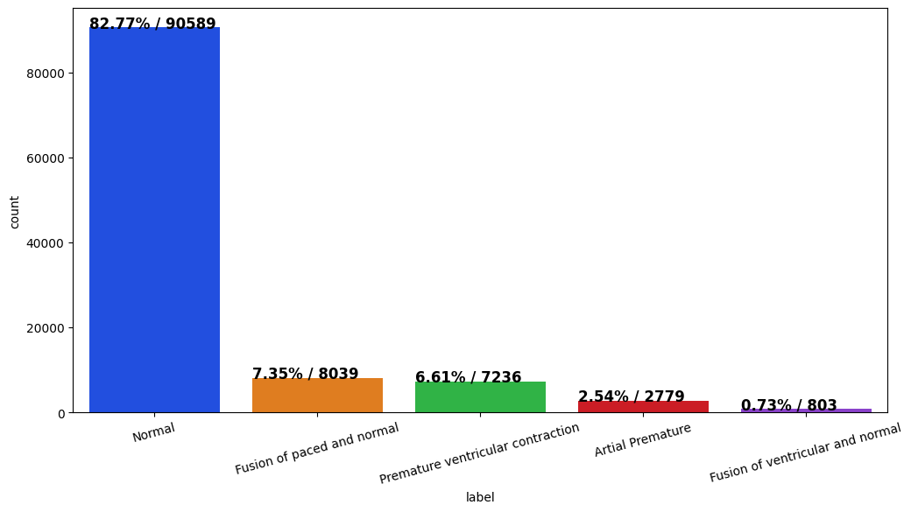
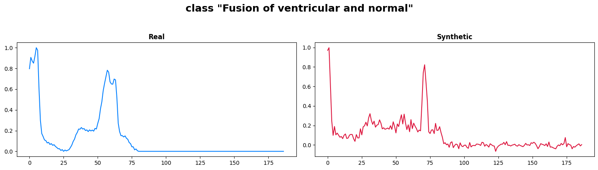
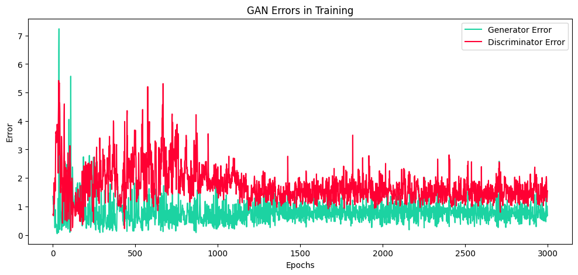
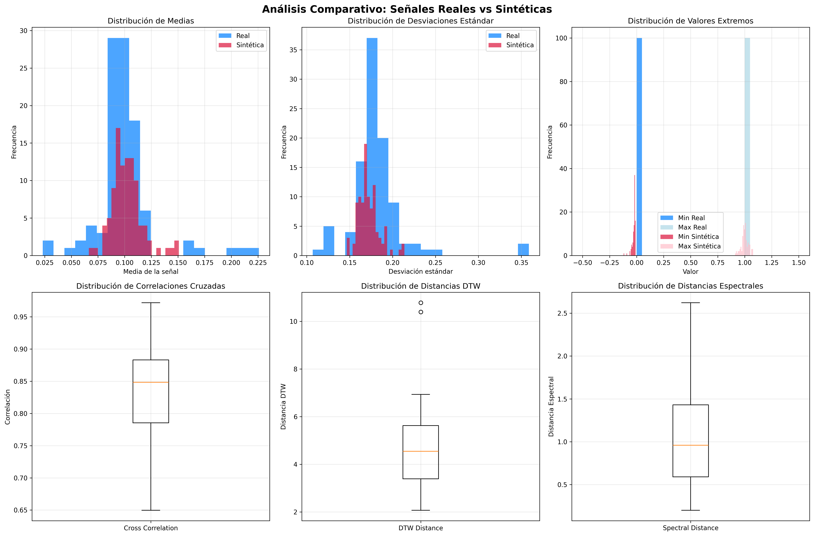

# 🧠 Generación de Señales ECG Sintéticas Usando Redes Generativas Adversarias (GANs)

## 1️⃣ Contexto y Motivación

En el ámbito de la **Ingeniería Biomédica**, la disponibilidad de bases de datos amplias y balanceadas de señales ECG es limitada. Aunque repositorios como **PTB-XL** y **MIT-BIH Arrhythmia Database** son referencias importantes, presentan limitaciones de representatividad y diversidad fisiopatológica.

Esto afecta la:

* **Formación académica**, al restringir el entrenamiento en análisis de señales reales y diversas.
* **Validación de algoritmos**, al no disponer de suficientes datos para evaluar modelos de clasificación o segmentación de ECG.
* **Reproducibilidad científica**, debido a restricciones de tamaño o acceso.

El presente proyecto desarrolla un **modelo generativo basado en GANs unidimensionales (1D-GAN)** para **producir señales ECG sintéticas realistas y controladas**, que complementen las bases de datos reales y sirvan como fuente para **educación, investigación y benchmarking** de algoritmos de aprendizaje profundo en biomedicina.

---

## 2️⃣ Objetivo General

Implementar y evaluar un **modelo 1D-GAN** capaz de generar señales ECG sintéticas que preserven la morfología de los complejos **P-QRS-T** y las características fisiológicas observadas en señales reales.

### Objetivos específicos

* Diseñar y entrenar una **arquitectura GAN 1D** adaptada a series temporales biomédicas.
* Analizar la calidad morfológica y espectral de las señales generadas.
* Validar la similitud entre señales reales y sintéticas mediante métricas cuantitativas (RMSE, correlación, DTW, FID).
* Crear un conjunto reproducible de señales ECG sintéticas documentadas.

---

## 3️⃣ Metodología

### 🔹 1. Preparación de datos

* Dataset base: **MIT-BIH Arrhythmia Database (PhysioNet)**.
* Procesamiento: normalización de amplitud, segmentación en ciclos cardíacos, padding y escalado temporal uniforme.
* División: entrenamiento (80%), validación (10%) y prueba (10%).

### 🔹 2. Diseño del modelo

* **Generador:** red convolucional transpuesta 1D con capas BatchNorm y activaciones ReLU.
* **Discriminador:** red CNN-1D con capas convolucionales, LeakyReLU y dropout.
* **Entrenamiento:**

  * Pérdida adversarial: Binary Cross-Entropy (BCE).
  * Optimizadores Adam (lr=0.0002, β₁=0.5).
  * Épocas: 500–1000.
  * Entrada: ruido gaussiano z ∈ ℝⁿ (normalizado).

### 🔹 3. Evaluación

* Métricas:

  * **RMSE**, **MAE**, **DTW**, **Correlación de Pearson**.
  * **FID adaptado para señales 1D** mediante proyecciones en espacio latente.
* Visualización:

  * Superposición de señales reales vs. sintéticas.
  * Comparación de la densidad espectral de potencia (PSD).

---

## 4️⃣ Resultados Principales (`4_GAN_1D.ipynb`)

* El modelo **1D-GAN** logró generar señales con morfología coherente del complejo P-QRS-T.
* La **distancia RMSE promedio** entre señales reales y sintéticas se redujo progresivamente a lo largo del entrenamiento (convergencia estable).
* Se evidenció una **alta correlación (>0.9)** entre ciclos reales y generados en el dominio temporal.
* Las **curvas de densidad espectral de potencia (PSD)** mostraron similitud estructural en las bandas de baja y media frecuencia (0–40 Hz).
* Las señales sintéticas preservan la **variabilidad fisiológica** esperada (intervalos RR y amplitudes QRS).






---

## 5️⃣ Métricas Recomendadas para Evaluación

| Tipo de métrica                | Descripción                             | Implementación                            |
| ------------------------------ | --------------------------------------- | ----------------------------------------- |
| **RMSE / MAE**                 | Error punto a punto                     | NumPy / SciPy                             |
| **DTW Distance**               | Alineamiento temporal flexible          | `dtaidistance` o `fastdtw`                |
| **Correlación de Pearson (r)** | Similitud global entre ondas            | `scipy.stats.pearsonr`                    |
| **FID adaptado**               | Distancia de Fréchet en espacio latente | Adaptación 1D basada en embeddings de CNN |
| **PSD Similarity**             | Comparación de espectro de energía      | `scipy.signal.welch`                      |

---

## 6️⃣ Impacto y Aplicaciones

* **Educación:** facilita la enseñanza de procesamiento de señales ECG sin depender de bases propietarias.
* **Investigación:** permite validar algoritmos de clasificación, segmentación o detección de arritmias.
* **Innovación tecnológica:** promueve el uso de **modelos generativos avanzados** (GANs, Diffusion Models) en biomedicina.
* **Extensibilidad:** adaptable a señales EMG, EEG o PPG mediante ajustes de arquitectura y normalización.

---

## 7️⃣ Próximos Pasos

* Explorar arquitecturas **WGAN-GP** y **TimeGAN** para mejorar la estabilidad del entrenamiento.
* Integrar métricas de similitud perceptual (LPIPS adaptado a 1D).
* Implementar un módulo de **control condicional** (cGAN) para generar señales con parámetros fisiológicos específicos (frecuencia cardíaca, duración PR/QT).
* Publicar un **dataset sintético etiquetado** y su pipeline reproducible.

---

## 📦 Estructura del Proyecto

```
├── notebooks/
│   ├── 1_preprocesamiento.ipynb
│   ├── 2_analisis_exploratorio.ipynb
│   ├── 3_modelo_GAN_basico.ipynb
│   ├── 4_GAN_1D.ipynb          ← Entrenamiento final y resultados
├── data/
│   ├── MITDB/                  ← Datos reales
│   ├── synthetic/              ← Señales generadas
├── models/
│   ├── generator_1D.pth
│   ├── discriminator_1D.pth
├── README.md
└── requirements.txt
```

---

## 👨‍💻 Autor

**Moisés Meza**