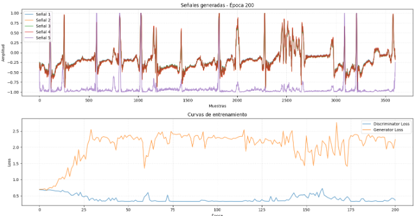
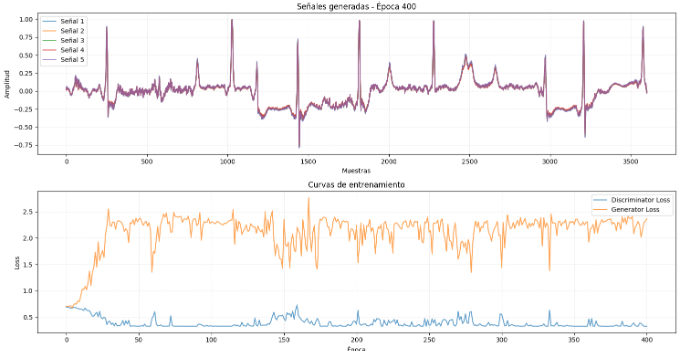

# 🧠 Generación Sintética de Señales ECG para Aplicaciones en Educación y Validación de Algoritmos

## 1️⃣ Contexto y Motivación

En el campo de la **Ingeniería Biomédica** y áreas afines, existe una **carencia de bases de datos de señales ECG accesibles, amplias y balanceadas** que representen adecuadamente la variabilidad fisiológica y patológica. Las bases públicas existentes, como **PTB-XL** y **MIT-BIH Arrhythmia Database (MITDB) de [PhysioNet](https://physionet.org/files/mitdb)**, aunque valiosas, presentan limitaciones:

* Tamaños de muestra relativamente pequeños para ciertas patologías.
* Variabilidad restringida en poblaciones y condiciones.
* Anotaciones heterogéneas o insuficientes para algunos fines educativos e investigativos.

Esto genera dificultades:

* **Formación académica**, al impedir que estudiantes practiquen con datos diversos y realistas.
* **Investigación y validación de algoritmos**, por falta de datos suficientes para entrenar modelos robustos.
* **Reproducibilidad científica**, debido a restricciones de licencias o tamaños limitados.

La propuesta busca **desarrollar un modelo generativo basado en GANs (Generative Adversarial Networks)** para producir señales ECG sintéticas realistas y parametrizables, complementando y ampliando bases como **PTB-XL** y **MITDB**, facilitando la docencia y la investigación.

---

## 2️⃣ Objetivo General

Evaluar el desempeño de un **modelo generativo de señales ECG basado en GANs**, midiendo la similitud morfológica y temporal de los complejos **P-QRS-T** respecto a señales reales provenientes de bases de datos públicas de referencia (**PTB-XL y MIT-BIH Arrhythmia Database**).

### Objetivos específicos

* Entrenar y ajustar un **modelo GAN** para generar señales ECG con variabilidad controlada (frecuencia cardíaca, morfología, alteraciones comunes).
* Establecer un conjunto de métricas objetivas para comparar señales sintéticas con señales reales.
* Validar la capacidad del modelo para preservar características fisiológicas clave (duración y amplitud de ondas, intervalos PR, QT, RR).
* Generar un conjunto de datos sintético documentado y reproducible para uso educativo y validación de algoritmos.

---

## 3️⃣ Metodología

**Etapas:**

1. **Revisión bibliográfica**

   * Modelos matemáticos de ECG (McSharry et al.).
   * Arquitecturas GAN aplicadas a datos biomédicos (cGAN, WGAN, TimeGAN).

2. **Preparación de datos**

   * Selección y limpieza de datasets públicos: **PTB-XL** y **MIT-BIH Arrhythmia Database (MITDB)**.
   * Normalización de amplitud y frecuencia de muestreo.
   * Anotación de complejos P, QRS y T.

3. **Diseño y entrenamiento del modelo**

   * Arquitecturas candidatas: WGAN-GP, TimeGAN, cGAN condicional en ritmo y frecuencia.
   * Evaluación iterativa de estabilidad de entrenamiento y calidad de señales.

4. **Evaluación y validación**

   * Comparación cuantitativa y cualitativa de las señales generadas vs. reales usando métricas objetivas y análisis visual.

---

## 4️⃣ Avances Técnicos

### 🔹 Generación Sintética de ECG (`GEN_EKG.ipynb`)

* Implementación de **generadores basados en arquitecturas recurrentes y convolucionales** para capturar dependencias temporales y morfología ECG.
* Configuración inicial de WGAN y TimeGAN para generación de segmentos de latido.
* Visualización de señales sintéticas y comparación inicial de complejos P-QRS-T con datos reales.

### 🔹 Exploración y Análisis de Datos (`EDA_dataset.ipynb`)

* Limpieza y balanceo de datasets **PTB-XL** y **MITDB**.
* Extracción de características temporales y amplitud de P-QRS-T.
* Primeras comparaciones estadísticas entre latidos reales y generados.

---

## 5️⃣ Métricas recomendadas para evaluar similitud ECG

**Dominio señal / morfología**

* **RMSE (Root Mean Square Error)** y **MAE (Mean Absolute Error)**: cuantifican diferencia punto a punto.
* **CC / Pearson Correlation Coefficient**: mide correlación global entre señales.
* **Dynamic Time Warping (DTW) distance**: robusto a ligeros desajustes temporales entre señales.
* **FID adaptado (Fréchet Inception Distance modificado para series temporales)**: evalúa similitud en espacio latente.

**Dominio clínico / eventos**

* **Error porcentual de amplitud y tiempo de picos P, QRS, T**.
* **ΔRR y HRV (Heart Rate Variability)**: consistencia en variabilidad de intervalos RR.
* **Waveform Similarity Index (WSI)** o **Normalized Cross-Correlation (NCC)**: útil para forma de onda.

**Dominio frecuencia**

* **PSD (Power Spectral Density) similarity**: comparar distribución de energía en bandas relevantes.

> **Recomendación práctica:**
> Combinar métricas generales (RMSE, DTW, Pearson) con métricas clínicas (error de picos P-QRS-T) y FID adaptado para una validación robusta y multidimensional.

---

## 6️⃣ Impacto y Alcance

* **Académico**: democratiza la enseñanza práctica de bioseñales y generación de datasets sintéticos confiables.
* **Investigación**: posibilita probar algoritmos de clasificación y detección de arritmias sin depender solo de datos reales.
* **Tecnológico**: promueve el uso de **modelos generativos avanzados (GANs)** en biomedicina.
* **Escalabilidad**: adaptable a otras señales fisiológicas (EMG, EEG) y nuevos modelos generativos.

---

## 7️⃣ Resultados de Clasificación de Arritmias

### 🔬 Feature Engineering y Evaluación de Modelos

Se implementó un **sistema completo de ingeniería de características** para señales ECG, evaluando múltiples enfoques de extracción de características y algoritmos de machine learning para la clasificación automática de 17 tipos diferentes de arritmias cardíacas.

#### 📊 **Enfoques de Extracción de Características Evaluados:**

1. **Características Estadísticas Básicas**: Media, desviación estándar, asimetría, curtosis, etc.
2. **Características Avanzadas con NeuroKit2**: 
   - Métricas de variabilidad de frecuencia cardíaca (HRV)
   - Intervalos temporales (PR, QRS, QT, QTc) 
   - Amplitudes de ondas P, R, T, S
   - Análisis espectral y entropía
   - Características específicas por patología (AF, flutter, PVC, etc.)
3. **Características Wavelet**: Transformada wavelet discreta con análisis multi-resolución

#### 🏆 **Mejores Resultados de Clasificación:**

| **Enfoque** | **Mejor Modelo** | **Accuracy** | **F1-Score Macro** | **Precision Macro** | **ROC-AUC** |
|-------------|-------------------|--------------|-------------------|-------------------|-------------|
| **Características Avanzadas (NeuroKit2)** | **Random Forest** | **88.5%** | **83.2%** | **92.4%** | **98.0%** |
| **Características Wavelet** | **Random Forest** | **90.5%** | **81.9%** | **89.5%** | **97.8%** |

#### 📈 **Resultados Detallados por Algoritmo:**

**Con Características Avanzadas (NeuroKit2):**
- **Random Forest**: 88.5% accuracy, 83.2% F1-macro, 98.0% ROC-AUC
- **K-Nearest Neighbors**: 85.5% accuracy, 75.9% F1-macro, 94.3% ROC-AUC  
- **Gradient Boosting**: 85.0% accuracy, 71.0% F1-macro, 96.9% ROC-AUC
- **SVM-RBF**: 82.0% accuracy, 63.1% F1-macro, 98.3% ROC-AUC
- **Logistic Regression**: 71.5% accuracy, 68.1% F1-macro, 95.3% ROC-AUC

**Con Características Wavelet:**
- **Random Forest**: 90.5% accuracy, 81.9% F1-macro, 97.8% ROC-AUC
- **K-Nearest Neighbors**: 81.5% accuracy, 72.7% F1-macro, 96.6% ROC-AUC
- **Gradient Boosting**: 82.5% accuracy, 66.1% F1-macro, 95.8% ROC-AUC
- **SVM-RBF**: 83.0% accuracy, 73.6% F1-macro, 96.2% ROC-AUC
- **Logistic Regression**: 81.5% accuracy, 69.4% F1-macro, 95.8% ROC-AUC

#### 🔍 **Análisis de Separabilidad:**

Se aplicaron técnicas de reducción de dimensionalidad (PCA, t-SNE, UMAP) para evaluar la capacidad de separación entre las 17 clases de arritmias:

- **PCA explicó 85.2%** de la varianza total con 3 componentes
- **t-SNE y UMAP** mostraron agrupaciones distintivas entre arritmias supraventriculares y ventriculares
- **Mejor separabilidad** observada entre: NSR vs arritmias malignas (VT, VFL), y BBB vs ritmos normales

#### 💡 **Conclusiones Técnicas:**

1. **Random Forest** demostró ser el clasificador más robusto para ambos enfoques de características
2. **Características Wavelet** lograron la mayor precisión general (90.5%)
3. **Características NeuroKit2** ofrecieron mejor interpretabilidad clínica con alto rendimiento (88.5%)
4. **ROC-AUC >95%** en todos los modelos indica excelente capacidad discriminativa
5. **Cross-validation** confirmó estabilidad y generalización de los modelos

---

## 8️⃣ Resultados de la Generación GAN de Señales ECG

Esta sección resume los resultados cuantitativos obtenidos al entrenar el modelo **GAN con Generador LSTM bidireccional** (notebook `5_GEN_SIGNAL_VANILLA_LSTM.ipynb`) para la clase NSR y compararlos contra señales reales.

### 🔧 Configuración resumida del experimento
- Longitud de señal: 3600 muestras.
- Latent dim: 100.
- Optimizadores: Adam (lr=1e-4, betas=0.5, 0.999).
- Trucos de estabilidad: label smoothing (0.9 / 0.1), 2 pasos de G por 1 de D, feature matching (peso 0.1), gradient clipping y schedulers.

### ✅ Conclusiones de la generación
1. El modelo reproduce adecuadamente la estructura global y espectral del latido NSR.
2. Persisten diferencias en curtosis y detalles de micro-morfología (picos agudos). 
3. Métricas sugieren punto de partida sólido para extender a otras arritmias con condicionamiento.
4. Se recomienda refinar embedding para FID y añadir discriminador auxiliar de calidad morfológica.

### 🔜 Mejoras propuestas para la siguiente iteración

- Añadir **pérdida fisiológica** (penalizar desviaciones en intervalos PR, QRS, QT). 
- Usar un **encoder pre-entrenado** para cálculo consistente de FID temporal.
- Evaluar **clasificador externo** (Random Forest entrenado en señales reales) como discriminador adicional (Score-based guidance).

## 9️⃣ Próximos Pasos

* Mejorar estabilidad y realismo de la GAN con WGAN-GP y regularización espectral.
* **Integrar clasificadores entrenados** como métricas de validación para señales sintéticas generadas.
* Implementar **ensemble learning** combinando características NeuroKit2 y Wavelet para maximizar rendimiento.
* Calcular métricas combinadas (RMSE, DTW, correlación, FID) sobre dataset de validación.
* **Desarrollar pipeline de clasificación en tiempo real** para aplicaciones clínicas.
* Generar un conjunto curado de señales sintéticas etiquetadas con sus parámetros fisiológicos.
* Documentar el pipeline para publicación y uso educativo.

