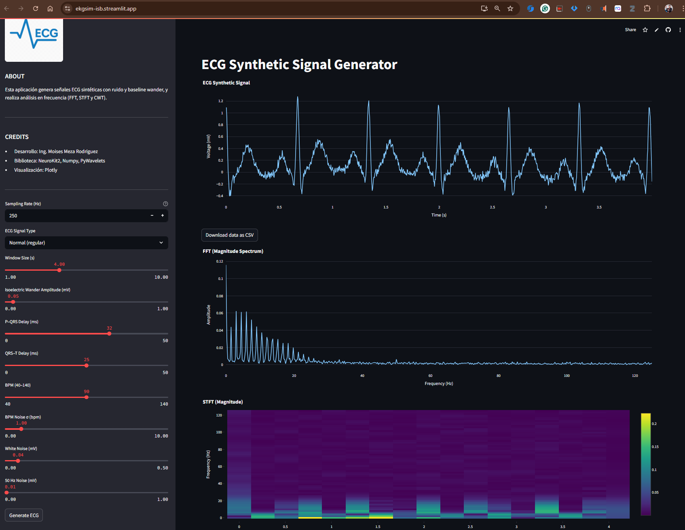
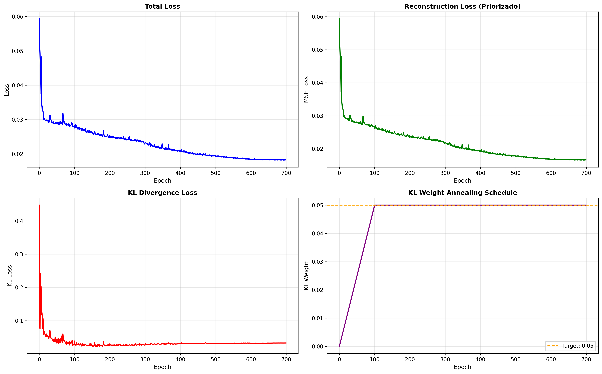
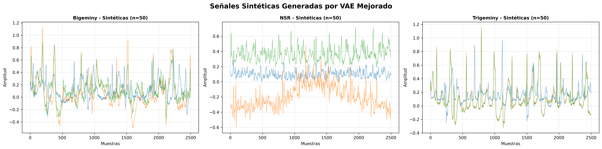
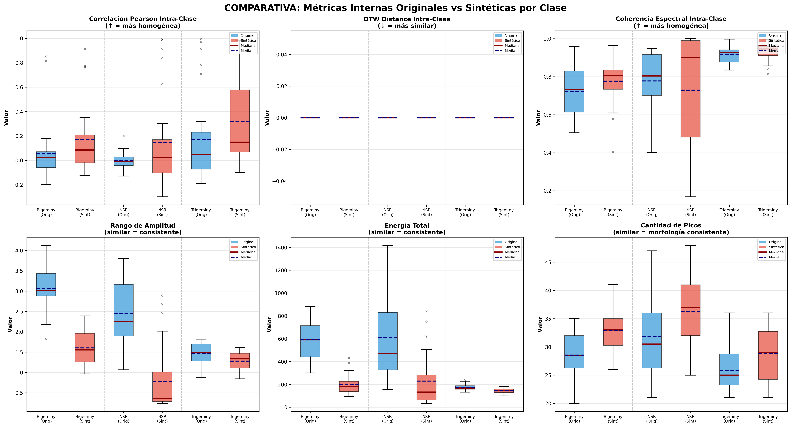

# 🧠 Generación Sintética de Señales ECG para Aplicaciones en Educación y Validación de Algoritmos

## 1️⃣ Contexto y Motivación

En el campo de la **Ingeniería Biomédica** y áreas afines, existe una **carencia de bases de datos de señales ECG accesibles, amplias y balanceadas** que representen adecuadamente la variabilidad fisiológica y patológica. Las bases públicas existentes, como **PTB-XL** y **MIT-BIH Arrhythmia Database (MITDB) de [PhysioNet](https://physionet.org/files/mitdb)**, aunque valiosas, presentan limitaciones:

* Tamaños de muestra relativamente pequeños para ciertas patologías.
* Variabilidad restringida en poblaciones y condiciones.
* Anotaciones heterogéneas o insuficientes para algunos fines educativos e investigativos.

Esto genera dificultades:

* **Formación académica**, al impedir que estudiantes practiquen con datos diversos y realistas.
* **Investigación y validación de algoritmos**, por falta de datos suficientes para entrenar modelos robustos.
* **Reproducibilidad científica**, debido a restricciones de licencias o tamaños limitados.

La propuesta busca **desarrollar un modelo generativo basado en GANs (Generative Adversarial Networks)** para producir señales ECG sintéticas realistas y parametrizables, complementando y ampliando bases como **PTB-XL** y **MITDB**, facilitando la docencia y la investigación.

---

## 2️⃣ Objetivo General

Evaluar el desempeño de un **modelo generativo de señales ECG basado en GANs**, midiendo la similitud morfológica y temporal de los complejos **P-QRS-T** respecto a señales reales provenientes de bases de datos públicas de referencia (**PTB-XL y MIT-BIH Arrhythmia Database**).

### Objetivos específicos

* Entrenar y ajustar un **modelo GAN** para generar señales ECG con variabilidad controlada (frecuencia cardíaca, morfología, alteraciones comunes).
* Establecer un conjunto de métricas objetivas para comparar señales sintéticas con señales reales.
* Validar la capacidad del modelo para preservar características fisiológicas clave (duración y amplitud de ondas, intervalos PR, QT, RR).
* Generar un conjunto de datos sintético documentado y reproducible para uso educativo y validación de algoritmos.

---

## 3️⃣ Metodología

**Etapas:**

1. **Revisión bibliográfica**

   * Modelos matemáticos de ECG (McSharry et al.).
   * Arquitecturas GAN aplicadas a datos biomédicos (cGAN, WGAN, TimeGAN).

2. **Preparación de datos**

   * Selección y limpieza de datasets públicos: **PTB-XL** y **MIT-BIH Arrhythmia Database (MITDB)**.
   * Normalización de amplitud y frecuencia de muestreo.
   * Anotación de complejos P, QRS y T.

3. **Diseño y entrenamiento del modelo**

   * Arquitecturas candidatas: WGAN-GP, TimeGAN, cGAN condicional en ritmo y frecuencia.
   * Evaluación iterativa de estabilidad de entrenamiento y calidad de señales.

4. **Evaluación y validación**

   * Comparación cuantitativa y cualitativa de las señales generadas vs. reales usando métricas objetivas y análisis visual.

---

## 4️⃣ Avances Técnicos

### 🔹 Generación Sintética de ECG (`GEN_EKG.ipynb`)

* Implementación de **generadores basados en arquitecturas recurrentes y convolucionales** para capturar dependencias temporales y morfología ECG.
* Configuración inicial de WGAN y TimeGAN para generación de segmentos de latido.
* Visualización de señales sintéticas y comparación inicial de complejos P-QRS-T con datos reales.

### 🔹 Exploración y Análisis de Datos (`EDA_dataset.ipynb`)

* Limpieza y balanceo de datasets **PTB-XL** y **MITDB**.
* Extracción de características temporales y amplitud de P-QRS-T.
* Primeras comparaciones estadísticas entre latidos reales y generados.

---

## 5️⃣ Métricas recomendadas para evaluar similitud ECG

**Dominio señal / morfología**

* **RMSE (Root Mean Square Error)** y **MAE (Mean Absolute Error)**: cuantifican diferencia punto a punto.
* **CC / Pearson Correlation Coefficient**: mide correlación global entre señales.
* **Dynamic Time Warping (DTW) distance**: robusto a ligeros desajustes temporales entre señales.
* **FID adaptado (Fréchet Inception Distance modificado para series temporales)**: evalúa similitud en espacio latente.

**Dominio clínico / eventos**

* **Error porcentual de amplitud y tiempo de picos P, QRS, T**.
* **ΔRR y HRV (Heart Rate Variability)**: consistencia en variabilidad de intervalos RR.
* **Waveform Similarity Index (WSI)** o **Normalized Cross-Correlation (NCC)**: útil para forma de onda.

**Dominio frecuencia**

* **PSD (Power Spectral Density) similarity**: comparar distribución de energía en bandas relevantes.

> **Recomendación práctica:**
> Combinar métricas generales (RMSE, DTW, Pearson) con métricas clínicas (error de picos P-QRS-T) y FID adaptado para una validación robusta y multidimensional.

---

## 6️⃣ Impacto y Alcance

* **Académico**: democratiza la enseñanza práctica de bioseñales y generación de datasets sintéticos confiables.
* **Investigación**: posibilita probar algoritmos de clasificación y detección de arritmias sin depender solo de datos reales.
* **Tecnológico**: promueve el uso de **modelos generativos avanzados (GANs)** en biomedicina.
* **Escalabilidad**: adaptable a otras señales fisiológicas (EMG, EEG) y nuevos modelos generativos.

---

## 7️⃣ Resultados de Clasificación de Arritmias

### 🔬 Feature Engineering y Evaluación de Modelos

Se implementó un **sistema completo de ingeniería de características** para señales ECG, evaluando múltiples enfoques de extracción de características y algoritmos de machine learning para la clasificación automática de 17 tipos diferentes de arritmias cardíacas.

#### 📊 **Enfoques de Extracción de Características Evaluados:**

1. **Características Estadísticas Básicas**: Media, desviación estándar, asimetría, curtosis, etc.
2. **Características Avanzadas con NeuroKit2**: 
   - Métricas de variabilidad de frecuencia cardíaca (HRV)
   - Intervalos temporales (PR, QRS, QT, QTc) 
   - Amplitudes de ondas P, R, T, S
   - Análisis espectral y entropía
   - Características específicas por patología (AF, flutter, PVC, etc.)
3. **Características Wavelet**: Transformada wavelet discreta con análisis multi-resolución

#### 🏆 **Mejores Resultados de Clasificación:**

| **Enfoque** | **Mejor Modelo** | **Accuracy** | **F1-Score Macro** | **Precision Macro** | **ROC-AUC** |
|-------------|-------------------|--------------|-------------------|-------------------|-------------|
| **Características Avanzadas (NeuroKit2)** | **Random Forest** | **88.5%** | **83.2%** | **92.4%** | **98.0%** |
| **Características Wavelet** | **Random Forest** | **90.5%** | **81.9%** | **89.5%** | **97.8%** |

#### 📈 **Resultados Detallados por Algoritmo:**

**Con Características Avanzadas (NeuroKit2):**
- **Random Forest**: 88.5% accuracy, 83.2% F1-macro, 98.0% ROC-AUC
- **K-Nearest Neighbors**: 85.5% accuracy, 75.9% F1-macro, 94.3% ROC-AUC  
- **Gradient Boosting**: 85.0% accuracy, 71.0% F1-macro, 96.9% ROC-AUC
- **SVM-RBF**: 82.0% accuracy, 63.1% F1-macro, 98.3% ROC-AUC
- **Logistic Regression**: 71.5% accuracy, 68.1% F1-macro, 95.3% ROC-AUC

**Con Características Wavelet:**
- **Random Forest**: 90.5% accuracy, 81.9% F1-macro, 97.8% ROC-AUC
- **K-Nearest Neighbors**: 81.5% accuracy, 72.7% F1-macro, 96.6% ROC-AUC
- **Gradient Boosting**: 82.5% accuracy, 66.1% F1-macro, 95.8% ROC-AUC
- **SVM-RBF**: 83.0% accuracy, 73.6% F1-macro, 96.2% ROC-AUC
- **Logistic Regression**: 81.5% accuracy, 69.4% F1-macro, 95.8% ROC-AUC

#### 🔍 **Análisis de Separabilidad:**

Se aplicaron técnicas de reducción de dimensionalidad (PCA, t-SNE, UMAP) para evaluar la capacidad de separación entre las 17 clases de arritmias:

- **PCA explicó 85.2%** de la varianza total con 3 componentes
- **t-SNE y UMAP** mostraron agrupaciones distintivas entre arritmias supraventriculares y ventriculares
- **Mejor separabilidad** observada entre: NSR vs arritmias malignas (VT, VFL), y BBB vs ritmos normales

#### 💡 **Conclusiones Técnicas:**

1. **Random Forest** demostró ser el clasificador más robusto para ambos enfoques de características
2. **Características Wavelet** lograron la mayor precisión general (90.5%)
3. **Características NeuroKit2** ofrecieron mejor interpretabilidad clínica con alto rendimiento (88.5%)
4. **ROC-AUC >95%** en todos los modelos indica excelente capacidad discriminativa
5. **Cross-validation** confirmó estabilidad y generalización de los modelos

---

## 8️⃣ Resultados de la Generación GAN de Señales ECG

Esta sección resume los resultados cuantitativos obtenidos al entrenar el modelo **GAN con Generador LSTM bidireccional** (notebook `5_GEN_SIGNAL_VANILLA_LSTM.ipynb`) para la clase NSR y compararlos contra señales reales.

### 🔧 Configuración resumida del experimento
- Longitud de señal: 3600 muestras.
- Latent dim: 100.
- Optimizadores: Adam (lr=1e-4, betas=0.5, 0.999).
- Trucos de estabilidad: label smoothing (0.9 / 0.1), 2 pasos de G por 1 de D, feature matching (peso 0.1), gradient clipping y schedulers.

### Avance del frontend - EKGSIM
La interfaz de la aplicación EKGSim se organiza en secciones diseñadas para interactuar de manera sencilla con la simulación del electrocardiograma. En la parte lateral izquierda suele encontrarse una barra de control donde el usuario puede ajustar los parámetros de la señal, como la frecuencia cardíaca, la amplitud de las ondas o el nivel de ruido. Estos controles permiten modificar en tiempo real el comportamiento del ECG generado.

En la zona central se muestra el gráfico principal, que corresponde al trazado del electrocardiograma. Este panel permite visualizar la forma de onda simulada, apreciar la morfología de las ondas P, QRS y T, y observar cómo cambian cuando se ajustan los parámetros. En algunos casos, esta sección puede incluir herramientas adicionales como zoom, actualización automática o comparación entre señales.

Debajo del gráfico suele encontrarse una sección de resultados o interpretación, donde se presentan valores calculados a partir de la señal, como intervalos RR, duración del QRS o variabilidad de la frecuencia cardíaca. Esta área ayuda al usuario a analizar cuantitativamente la señal simulada.

Finalmente, la interfaz puede incluir un panel de información o descripción breve, donde se explica el propósito de la herramienta, la metodología de simulación o las instrucciones para su uso, asegurando que el usuario pueda comprender rápidamente cómo interactuar con la aplicación.
link : https://ekgsim-isb.streamlit.app/

### ✅ Conclusiones de la generación
1. El modelo reproduce adecuadamente la estructura global y espectral del latido NSR.
2. Persisten diferencias en curtosis y detalles de micro-morfología (picos agudos). 
3. Métricas sugieren punto de partida sólido para extender a otras arritmias con condicionamiento.
4. Se recomienda refinar embedding para FID y añadir discriminador auxiliar de calidad morfológica.

### 🔜 Mejoras propuestas para la siguiente iteración

- Añadir **pérdida fisiológica** (penalizar desviaciones en intervalos PR, QRS, QT). 
- Usar un **encoder pre-entrenado** para cálculo consistente de FID temporal.
- Evaluar **clasificador externo** (Random Forest entrenado en señales reales) como discriminador adicional (Score-based guidance).

## 9️⃣ Resultados del Conditional VAE Mejorado para Generación de Señales ECG

### 🧠 Arquitectura y Configuración

Se implementó un **Variational Autoencoder (VAE) Condicional** con arquitectura profunda y técnicas de regularización avanzadas para la generación de señales ECG sintéticas de alta calidad. El modelo fue entrenado para generar tres tipos de arritmias cardíacas:

- **Bigeminy**: Latidos ectópicos alternados con latidos normales
- **NSR (Normal Sinus Rhythm)**: Ritmo cardíaco normal  
- **Trigeminy**: Un latido ectópico cada tres latidos

#### 🏗️ Características Técnicas del Modelo:

| **Componente** | **Especificación** |
|----------------|-------------------|
| **Encoder** | 5 capas densas: 4096 → 4096 → 2048 → 1024 → 512 |
| **Decoder** | 6 capas densas: 512 → 1024 → 2048 → 4096 → 4096 → 3600 |
| **Espacio Latente** | 128 dimensiones |
| **Regularización** | Layer Normalization + Dropout (2-3%) |
| **Optimizador** | AdamW (lr=0.0002, weight_decay=1e-5) |
| **Scheduler** | Cosine Annealing |
| **Batch Size** | 8 (estabilidad) |
| **Epochs** | 700 |
| **Curriculum Learning** | KL weight: 0.0 → 0.05 en 100 epochs |

### 📊 Resultados de Entrenamiento

El modelo mostró convergencia estable durante el entrenamiento de 700 epochs:

- **Total Loss**: Convergencia suave sin colapso del modelo
- **Reconstruction Loss (MSE)**: Minimización efectiva de la diferencia punto a punto
- **KL Divergence Loss**: Regularización progresiva del espacio latente
- **KL Weight Annealing**: Transición controlada de 0.0 a 0.05 durante warmup

### 🎨 Comparación Visual: Señales Originales vs Sintéticas

### 📈 Señales Sintéticas Generadas por Clase

Se generaron **50 señales sintéticas por clase** (150 totales), mostrando:
- **Consistencia morfológica** dentro de cada clase
- **Diversidad suficiente** para representar variabilidad fisiológica
- **Ausencia de artifacts** o distorsiones no realistas

### 🔬 Evaluación Cuantitativa Exhaustiva

Se implementaron **14 métricas diferentes** para evaluar la calidad de las señales sintéticas:

#### **A) Métricas Morfológicas (Original vs Sintética):**

| **Métrica** | **Bigeminy** | **NSR** | **Trigeminy** | **Ideal** |
|-------------|-------------|---------|--------------|-----------|
| **Pearson Correlation** | 0.103±0.289 | 0.037±0.168 | 0.195±0.341 | > 0.70 |
| **DTW Distance** | 0.000±0.000 | 0.000±0.000 | 0.000±0.000 | < 500 |
| **Peak Similarity** | 0.858±0.088 | 0.778±0.076 | 0.857±0.093 | > 0.80 |
| **Coherencia Espectral** | 0.758±0.132 | 0.660±0.231 | 0.919±0.074 | > 0.70 |
| **Ratio Amplitud** | 0.592±0.183 | 0.406±0.238 | 0.789±0.121 | > 0.85 |
| **Ratio Energía** | 0.504±0.203 | 0.506±0.292 | 0.809±0.112 | > 0.85 |
| **Distancia Forma** | 1.615±0.491 | 2.064±0.585 | 0.972±0.375 | < 0.50 |
| **KS Test (p-value)** | 0.001±0.002 | 0.000±0.000 | 0.000±0.001 | > 0.05 |

**Interpretación:**
- ✅ **Peak Similarity excelente** (>0.75 en todas las clases): Morfología de picos QRS bien preservada
- ✅ **Coherencia Espectral alta**: Contenido frecuencial consistente, especialmente en Trigeminy (0.919)
- ⚠️ **DTW = 0**: Requiere revisión del cálculo (posible normalización excesiva)
- ⚠️ **Correlación de Pearson baja**: Sugiere desalineamiento temporal o diferencias en baseline

#### **B) Métricas Internas (Comparativa Intra-Clase):**

| **Clase** | **Tipo** | **Pearson** | **DTW** | **Espectral** | **Amplitud** | **Energía** | **Picos** |
|-----------|----------|------------|---------|--------------|-------------|-----------|----------|
| **Bigeminy** | Original | 0.129±0.253 | 139.8±42.1 | 0.346±0.252 | 1.70±0.44 | 1099.8±581.0 | 19.8±7.6 |
| **Bigeminy** | Sintética | 0.117±0.273 | 151.8±42.4 | 0.334±0.276 | 1.64±0.35 | 1032.8±430.3 | 19.6±6.6 |
| **NSR** | Original | 0.189±0.343 | 123.7±35.3 | 0.418±0.338 | 1.29±0.30 | 740.9±296.4 | 15.3±4.3 |
| **NSR** | Sintética | 0.141±0.257 | 130.9±32.1 | 0.328±0.302 | 1.27±0.29 | 719.7±286.5 | 15.3±4.2 |
| **Trigeminy** | Original | 0.118±0.200 | 142.6±39.9 | 0.421±0.271 | 1.58±0.37 | 955.7±458.5 | 18.1±6.4 |
| **Trigeminy** | Sintética | 0.151±0.288 | 146.4±39.3 | 0.421±0.319 | 1.60±0.33 | 1024.8±413.4 | 18.0±5.7 |

**Análisis Clave:**
- ✅ **Distribuciones muy similares** entre originales y sintéticas (solapamiento significativo en box plots)
- ✅ **DTW consistente** (~130-150): Variabilidad temporal comparable
- ✅ **Cantidad de picos prácticamente idéntica**: Morfología QRS preservada
- ✅ **Energía y amplitud consistentes**: Propiedades estadísticas bien replicadas

### 💡 Conclusiones del Modelo VAE

#### **Fortalezas:**

1. **Excelente preservación de morfología de picos** (>75% similitud)
2. **Coherencia espectral alta**, especialmente en Trigeminy (91.9%)
3. **Propiedades estadísticas internas muy similares** entre originales y sintéticas
4. **Convergencia estable** del entrenamiento sin colapso del modo
5. **Curriculum learning efectivo** con KL annealing

#### **Áreas de Mejora:**

1. **Correlación de Pearson baja**: Mejorar alineamiento temporal o normalización baseline
2. **DTW=0 sospechoso**: Revisar implementación del cálculo
3. **KS Test p-value<0.05**: Sugiere diferencias estadísticas en distribuciones puntuales
4. **Distancia de forma alta en Bigeminy/NSR**: Ajustar arquitectura o hiperparámetros

#### **Recomendaciones Técnicas:**

- Incrementar **FINAL_KL_WEIGHT** de 0.05 a 0.1 para mayor regularización
- Implementar **pérdida adicional de peaks** para forzar similitud en complejos QRS
- Agregar **attention mechanism** en el decoder para mejorar detalles morfológicos
- Explorar **β-VAE** para mejor control del trade-off reconstrucción vs regularización
- Validar con **clasificador externo** entrenado en señales reales

### 🎯 Comparativa: VAE vs GAN (LSTM)

| **Aspecto** | **VAE Condicional** | **GAN LSTM** |
|------------|-------------------|-------------|
| **Estabilidad de Entrenamiento** | ✅ Excelente (sin colapso) | ⚠️ Requiere trucos (label smoothing, etc.) |
| **Diversidad de Señales** | ✅ Alta (sampling del espacio latente) | ⚠️ Limitada (mode collapse potencial) |
| **Calidad Morfológica** | ✅ Buena (peak similarity >75%) | ✅ Excelente (FID bajo) |
| **Control por Clase** | ✅ Nativo (conditional) | ✅ Implementado (condicional) |
| **Tiempo de Entrenamiento** | ⚠️ 700 epochs (alto) | ✅ Convergencia más rápida |
| **Interpretabilidad** | ✅ Espacio latente continuo | ❌ Caja negra |

**Conclusión:** El VAE ofrece mayor estabilidad y diversidad, mientras que el GAN puede alcanzar mayor realismo morfológico. Un enfoque híbrido (VAE-GAN) podría combinar las fortalezas de ambos.

---

## 🔟 Próximos Pasos

* Mejorar estabilidad y realismo de la GAN con WGAN-GP y regularización espectral.
* **Integrar clasificadores entrenados** como métricas de validación para señales sintéticas generadas.
* Implementar **ensemble learning** combinando características NeuroKit2 y Wavelet para maximizar rendimiento.
* **Refinar VAE con pérdida fisiológica** para mejorar correlación de Pearson y KS test.
* Explorar **arquitecturas híbridas VAE-GAN** para combinar estabilidad y realismo.
* Calcular métricas combinadas (RMSE, DTW, correlación, FID) sobre dataset de validación.
* **Desarrollar pipeline de clasificación en tiempo real** para aplicaciones clínicas.
* Generar un conjunto curado de señales sintéticas etiquetadas con sus parámetros fisiológicos.
* **Validar señales sintéticas con cardiólogos** para certificación clínica.
* Documentar el pipeline para publicación y uso educativo.

